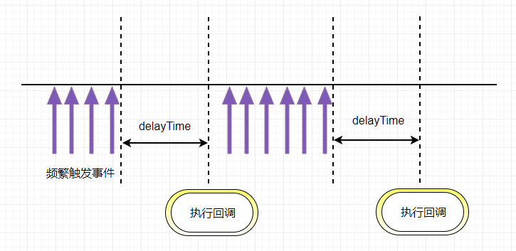
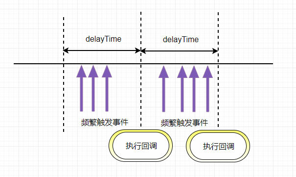

作为一名前端开发者，我们经常会处理各种事件，比如常见的click、scroll、 resize等等。仔细一想，会发现像scroll、scroll、onchange这类事件会频繁触发，如果我们在回调中计算元素位置、做一些跟DOM相关的操作，引起浏览器回流和重绘，频繁触发回调，很可能会造成浏览器掉帧，甚至会使浏览器崩溃，影响用户体验。针对这种现象，目前有两种常用的解决方案：防抖和节流。

## 防抖（debounce）

所谓防抖，就是指触发事件后，就是把触发非常频繁的事件合并成一次去执行。即在指定时间内只执行一次回调函数，如果在指定的时间内又触发了该事件，则回调函数的执行时间会基于此刻重新开始计算。

> 以我们生活中乘车刷卡的情景举例，只要乘客不断地在刷卡，司机师傅就不能开车，乘客刷卡完毕之后，司机会等待几分钟，确定乘客坐稳再开车。如果司机在最后等待的时间内又有新的乘客上车，那么司机等乘客刷卡完毕之后，还要再等待一会，等待所有乘客坐稳再开车。



具体应该怎么去实现这样的功能呢？第一时间肯定会想到使用setTimeout方法，那我们就尝试写一个简单的函数来实现这个功能吧~

```
var debounce = function(fn, delayTime) {
  var timeId;
  return function () {
    var context = this, args = arguments;
    timeId && clearTimeout(timeout);
    timeId = setTimeout(function {
      fn.apply(context, args);
    }, delayTime)
  }
}
    
```

思路解析：

执行debounce函数之后会返回一个新的函数，通过闭包的形式，维护一个变量timeId，每次执行该函数的时候会结束之前的延迟操作，重新执行setTimeout方法，也就实现了上面所说的指定的时间内多次触发同一个事件，会合并执行一次。

温馨提示：

1、上述代码中arguments只会保存事件回调函数中的参数，譬如：事件对象等，并不会保存fn、delayTime

2、使用apply改变传入的fn方法中的this指向，指向绑定事件的DOM元素。

## 节流（throttle）

所谓节流，是指频繁触发事件时，只会在指定的时间段内执行事件回调，即触发事件间隔大于等于指定的时间才会执行回调函数。

> 类比到生活中的水龙头，拧紧水龙头到某种程度会发现，每隔一段时间，就会有水滴流出。



说到时间间隔，大家肯定会想到使用setTimeout来实现，在这里，我们使用两种方法来简单实现这种功能：时间戳和setTimeout定时器。

### 时间戳

```
var throttle = (fn, delayTime) => {
  var _start = Date.now();
  return function () {
    var _now = Date.now(), context = this, args = arguments;
    if(_now - _start >= delayTime) {
      fn.apply(context, args);
      _start = Date.now();
    }
  }
}

```

通过比较两次时间戳的间隔是否大于等于我们事先指定的时间来决定是否执行事件回调。

### 定时器

```
var throttle = function (fn, delayTime) {
  var flag;
  return function () {
    var context = this, args = arguments;
    if(!flag) {
      flag = setTimeout(function () {
        fn.apply(context, args);
        flag = false;
      }, delayTime);
    }
  }
}
    
```
在上述实现过程中，我们设置了一个标志变量flag，当delayTime之后执行事件回调，便会把这个变量重置，表示一次回调已经执行结束。
对比上述两种实现，我们会发现一个有趣的现象：

1、使用时间戳方式，页面加载的时候就会开始计时，如果页面加载时间大于我们设定的delayTime，第一次触发事件回调的时候便会立即fn，并不会延迟。如果最后一次触发回调与前一次触发回调的时间差小于delayTime，则最后一次触发事件并不会执行fn；

2、使用定时器方式，我们第一次触发回调的时候才会开始计时，如果最后一次触发回调事件与前一次时间间隔小于delayTime，delayTime之后仍会执行fn。

这两种方式有点优势互补的意思，哈哈~

我们考虑把这两种方式结合起来，便会在第一次触发事件时执行fn，最后一次与前一次间隔比较短，delayTime之后再次执行fn。

想法简单实现如下：

```
var throttle = function (fn, delayTime) {
  var flag, _start = Date.now();
  return function () {
    var context = this,
      args = arguments,
      _now = Date.now(),
      remainTime = delayTime - (_now - _start);
    if(remainTime <= 0) {
      fn.apply(this, args);
    } else {
      setTimeout(function () {
        fn.apply(this, args);
      }, remainTime)
    }    
  }
}
    
```
通过上面的分析，可以很明显的看出函数防抖和函数节流的区别：

频繁触发事件时，函数防抖只会在最后一次触发事件只会才会执行回调内容，其他情况下会重新计算延迟事件，而函数节流便会很有规律的每隔一定时间执行一次回调函数。

## requestAnimationFrame
之前，我们使用setTimeout简单实现了防抖和节流功能，如果我们不考虑兼容性，追求精度比较高的页面效果，可以考虑试试html5提供的API--requestAnimationFrame。

与setTimeout相比，requestAnimationFrame的时间间隔是有系统来决定，保证屏幕刷新一次，回调函数只会执行一次，比如屏幕的刷新频率是60HZ，即间隔1000ms/60会执行一次回调。

```
 var throttle = function(fn, delayTime) {
  var flag;
  return function() {
    if(!flag) {
      requestAnimationFrame(function() {
        fn();
        flag = false;
      });
      flag = true;
    }
  }
  
```
上述代码的基本功能就是保证在屏幕刷新的时候（对于大多数的屏幕来说，大约16.67ms），可以执行一次回调函数fn。使用这种方式也存在一种比较明显的缺点，时间间隔只能跟随系统变化，我们无法修改，但是准确性会比setTimeout高一些。

注意：

1. 防抖和节流只是减少了事件回调函数的执行次数，并不会减少事件的触发频率。

2. 防抖和节流并没有从本质上解决性能问题，我们还应该注意优化我们事件回调函数的逻辑功能，避免在回调中执行比较复杂的DOM操作，减少浏览器reflow和repaint。

上面的示例代码比较简单，只是说明了基本的思路。目前已经有工具库实现了这些功能，比如underscore，考虑的情况也会比较多，大家可以去查看源码，学习作者的思路，加深理解。

underscore的debounce方法源码：

```
_.debounce = function(func, wait, immediate) {
    var timeout, result;

    var later = function(context, args) {
      timeout = null;
      if (args) result = func.apply(context, args);
    };

    var debounced = restArguments(function(args) {
      if (timeout) clearTimeout(timeout);
      if (immediate) {
        var callNow = !timeout;
        timeout = setTimeout(later, wait);
        if (callNow) result = func.apply(this, args);
      } else {
        timeout = _.delay(later, wait, this, args);
      }

      return result;
    });

    debounced.cancel = function() {
      clearTimeout(timeout);
      timeout = null;
    };

    return debounced;
  };
```
underscore的throttle源码：

```
_.throttle = function(func, wait, options) {
    var timeout, context, args, result;
    var previous = 0;
    if (!options) options = {};

    var later = function() {
      previous = options.leading === false ? 0 : _.now();
      timeout = null;
      result = func.apply(context, args);
      if (!timeout) context = args = null;
    };

    var throttled = function() {
      var now = _.now();
      if (!previous && options.leading === false) previous = now;
      var remaining = wait - (now - previous);
      context = this;
      args = arguments;
      if (remaining <= 0 || remaining > wait) {
        if (timeout) {
          clearTimeout(timeout);
          timeout = null;
        }
        previous = now;
        result = func.apply(context, args);
        if (!timeout) context = args = null;
      } else if (!timeout && options.trailing !== false) {
        timeout = setTimeout(later, remaining);
      }
      return result;
    };

    throttled.cancel = function() {
      clearTimeout(timeout);
      previous = 0;
      timeout = context = args = null;
    };

    return throttled;
  };
  
```