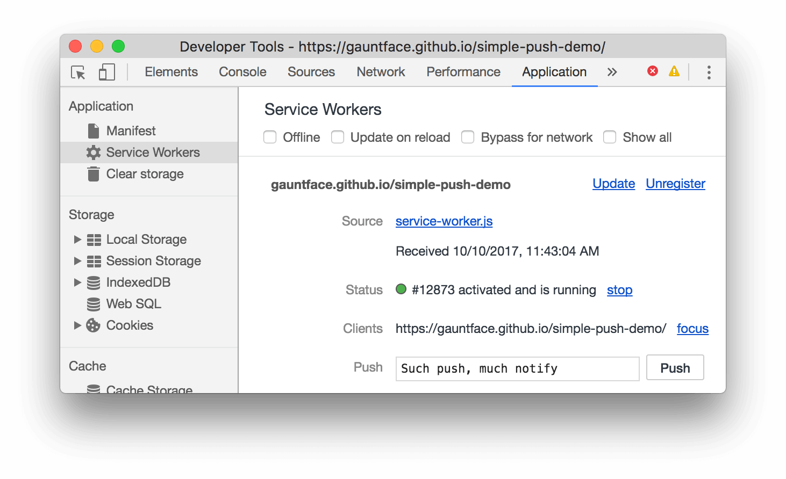
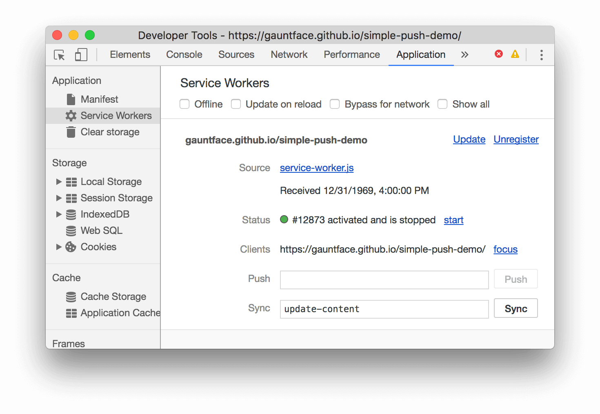

## [译文]Chrome63中开发者面板(Devtools)新增功能.md

[查看原文内容:https://developers.google.com/web/updates/2017/10/devtools-release-notes](https://developers.google.com/web/updates/2017/10/devtools-release-notes)

----------

欢迎回来！Chrome 63中提供给DevTools的新功能包括：

   * 支持了多客户端的远程调试功能
   * 工作区(workspace)2.0
   * 四个新的审计(audits)功能
   * 使用自定义的数据模拟推送通知功能（push notifications）
   * 使用自定义标签触发后台同步事件。


```
注意：你可以通过在地址栏运行 chrome://version 来检查你现在正在运行的chrome版本。
每六个星期chrome会自动更新到新的主要版本。
```

----------
#### 多客户端的远程调试功能

如果你曾经尝试使用 VS Code  或者 WebStorm 等IDE 来调试你的web app,则你可能会发现打开 devtools的过程会把你的调试的session搞乱。这个问题也会导致无法使用 DevTools 来调试WebDriver.

从chrome 63开始，DevTools现在默认支持了可以远程调试多个客户端，无需额外的配置。

多客户端的远程调试功能之前是在[crbug.com上排名第一的DevTools的问题](https://crbug.com/129539)，并且在整个Chromium项目中排名第三。
多客户端的远程调试功能的支持也为将其他工具与DevTools集成或以新方式使用这些工具开辟了不少有趣的机会。例如：

* 支持调试协议的客户端，例如 Chorme驱动，或者包含有Chrome调试功能的IDE，例如： VS Code 或者Webstorm，或者WebSocket客户端，例如Puppeteer，现在可以与DevTools同时运行。

* 两个独立的WebSocket协议客户端（例如[Puppeteer](https://github.com/GoogleChrome/puppeteer)或 [chrome-remote-interface](https://github.com/cyrus-and/chrome-remote-interface)）现在可以同时连接到同一个浏览器tab上。

* 使用chrome.debugger API 的 chrome的扩展程序现在可以与devtools面板同时运行

* 多个不同的chrome扩展程序现在可以在同一个浏览器tab上同时使用chrome.debugger API。

----------
#### 多客户端的远程调试功能

在DevTools 中，工作区(Workspaces)已经存在一段时间了。这项功能可以让你像使用IDE一样使用DevTools.你可以在DevTools中修改你的源代码，这些修改将会在你的文件系统中保留到你项目的本地版本中。


工作区（Workspaces）2.0在1.0的基础上，添加了更有用的用户体验，并改进了传输的代码的自动映射。此功能原定于Chrome 开发者峰会Chrome Developer Summit（CDS）2016后不久发布，但该团队推迟了这个功能，以解决一些问题。

----------
#### 四个新的网页审计(audits)点

* 在Chrome 63版本中，审计面板（Audits）有4项新的审计功能

* 是否支持WebP格式的图片

* 是否避免使用具有已知安全漏洞的JavaScript库

* 是否将浏览器错误log到控制台

可以查阅【在chrome devtools中运行lighthouse】  (https://developers.google.com/web/tools/lighthouse/#devtools)来了解如何使用“ 审计”面板来提高你开发的页面的质量。

可以查阅[lighthouse] (https://developers.google.com/web/tools/lighthouse/)来了解如何使用“ 审计”面板来提高你开发的页面的质量。

----------

#### 使用自定义的数据模拟推送通知功能

在DevTools 中，模拟推送通知的功能已经运行一段时间了，但有一个限制：您无法发送自定义数据。在chrome63中的Service Worker面板中，我们添加了新的推送(PUSH)文本框 。可以现在就试试：

1. 体验一个[简单的推送demo](https://gauntface.github.io/simple-push-demo/)

2. 点击 **启用推送通知**。

3. 当Chrome提示您允许通知时，请点击**允许**。

4. 打开 DevTools

5. 打开 Service Workers 面板

6. 在Push的文本框里面写点什么



**图表1：**
在Service Worker面板中通过Push文本框模拟一个自定义数据的推送通知

7 点击push按钮发送通知。


**图表2 ：**
模拟发送的推送通知
----------

#### 使用自定义标签出发后台同步事件

在Service Workers面板中，出发后台的同步事件也已经存在了一段时间，从现在开始，你可以发送自定义标签：

1. 打开DevTools。

2. 转到Service Workers面板

3. 在“ sync”文本框中输入一些文字。

4. 点击 sync 按钮



**图表3 ：**
点击 **sync** 按钮之后，DevTools 使用自定义标签发送了一个背景的同步事件，向service worker更新了内容。
----------
