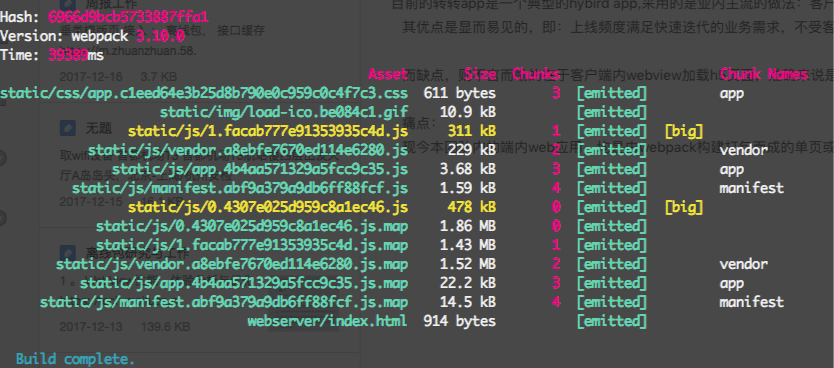
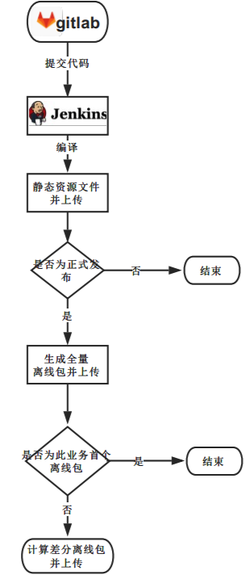
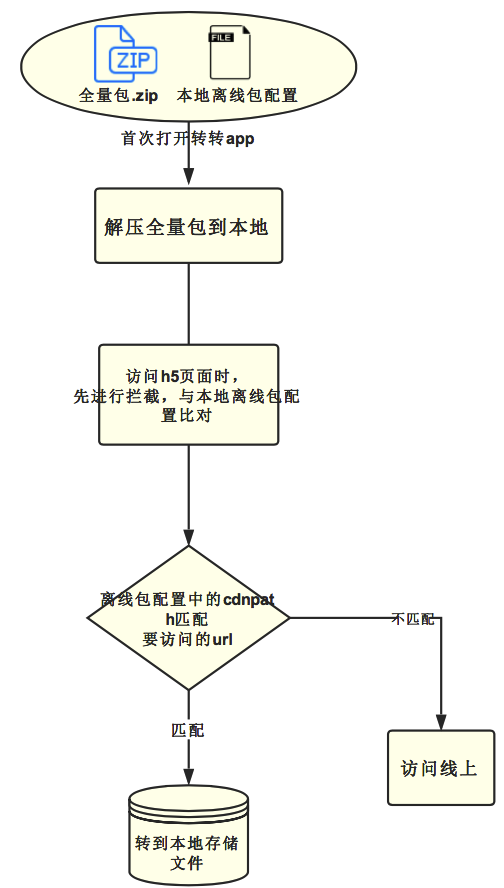
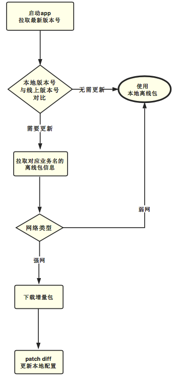
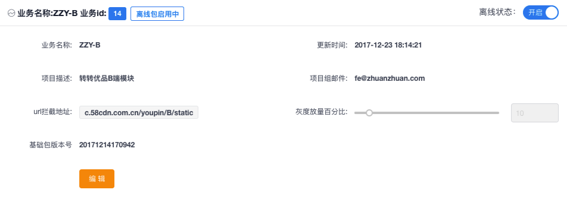
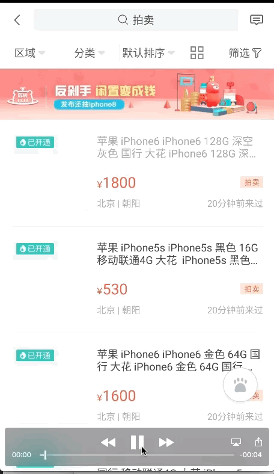
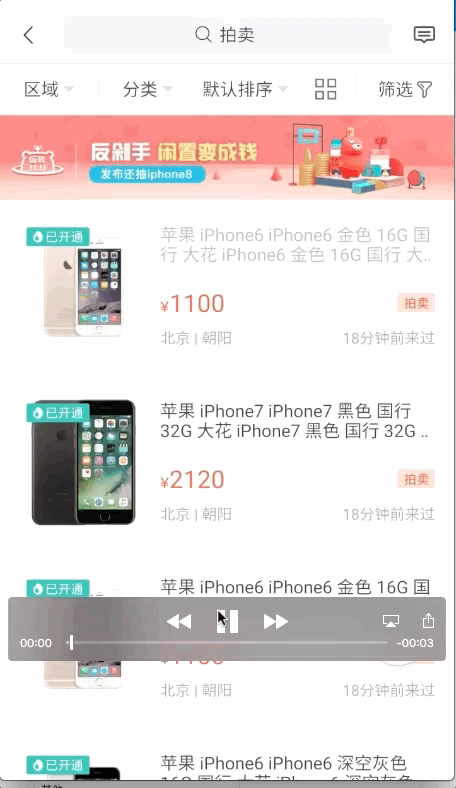
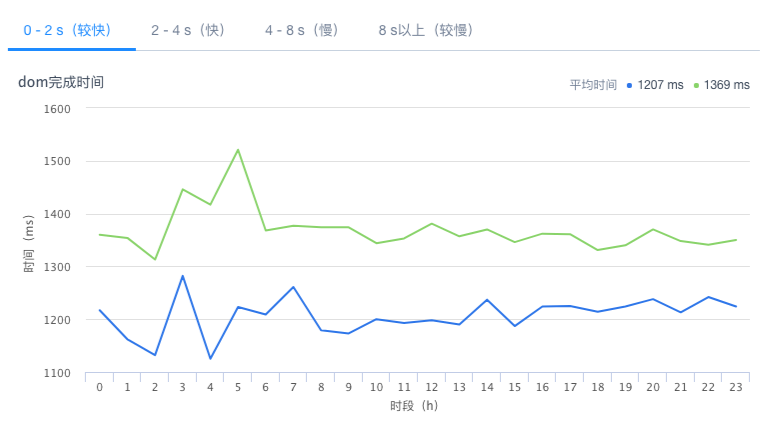

## 转转hybrid app web静态资源离线系统实践（上）
---

### 一.前言

> 目前的转转app是一个典型的hybrid app,采用的是业内主流的做法：
客户端内有大量业务页面使用webview内加载h5页面承载。

> 其优点是显而易见的，即：web页面上线频度满足快速迭代的业务需求，不受客户端审核和发版的时间限制，也可以将各个业务线的开发工作分摊到各个业务的fe团队上，使得个业务线可以并行开发。

> 而缺点，则不言而喻的在于客户端内webview加载h5页面，准确来说是web应用的性能和体验，是肯定不及客户端的。本篇文章中，笔者将会梳理立足于本团队内，根据团队的特点和制约，开发并实践web应用的静态资源离线系统的过程与实践。

#### 痛点1：

现今本团队内的端内web应用，均是由webpack构建打包而成的单页或多页web应用，前端工程构建完成的结果是这样的画风：

可以看出其静态资源均为几百k~几m不等，而这些静态资源均是首次打开页面时需要下载的，并且在web应用有更新时，这些静态资源文件均会发生变化，也需要重新下载。

**导致：首次打开·线上h5资源更新·网络条件差的时候，或者本地页面缓存失效的时候。**
出现：

面对海量的交易用户，提升web应用加载的体验成为了fe和app 工程师极力重视解决的一个问题。

#### 痛点2

**其一:**
 笔者之前也调研过 service worker等利用web api 来实现pwa的离线缓存的方案，但目前转转的app使用的还是系统原生的webview。暂时不支持pwa.[(点击查看本团队过往对于pwa项目的尝试总结)](https://www.cnblogs.com/zhuanzhuanfe/p/7573727.html)

**其二:**
 目前各个业务团队使用的技术栈的范围比较广，涵盖vue及react等。同时各个业务线均在保持快节奏的业务开发，需要设计一套能良好工作，更重要的是可以让各业务线前端工程可以低成本无痛接入，对业务代码不会产生侵入，不会引发风险与问题的接入方案。

### 我们的方案：

在调研了腾讯 手机QQ  阿里 美团 新浪 等公司的实现方案后，我们设计了自己的web应用静态资源离线系统方案：

图片是粗糙的，印象是模糊的。下面我们从 **前端构建和发布测** 和 **app测**  两个方向分别来分别阐述：

#### 1.前端构建和发布测：

我们采用腾讯alloy团队出品的生成离线包webpack插件：**ak-webpack-plugin**，其可以根据配置，将webpack的构建出的静态资源，压缩成映射了静态资源在cdn路径url的zip压缩包。
同时在配置的过程中，也可以选择 **排除掉** 部份文件（比如图片，并不是所有构建出的图片都是用得到的）。其生成的压缩结构如下：

> ##### 生成的离线资源如何让客户端如何上传呢？ ####

交由各个fe工程师手动上传吗？ 这样不太符合效率最大化的原则。幸好我们有持续集成和发布工具jenkins。在本团队的发布于上线流程中，他代替fe工程师构建与部署前端项目。使前端项目也像传统的app与后端项目一样做到了开发与构建部署分离，提高了团队的效率。
而我们生成和部署离线包的操作，也交由jenkins替我们完成。

#### 2.转转app测 ####
在客户端内，预制了一份最新的各业务线的离线包与版本号的配置表。app安装后首次启动时，会将压缩包解压到手机rom中。
各业务线配置中包含app访问线上的静态资源时需拦截的url规则map，当app访问到与规则map相匹配的地址时，就转为使用本地的资源，打到离线访问的目的。

> ##### 离线化后的资源如何更新呢？ ####

客户端启动后，向离线系统查询最新的各个业务的离线包版本号，依次跟本地配置中的对应业务线比较。
如果需要更新，则再次向离线系统查询此业务线的离线包信息，离线系统会提供此业务线的离线包的信息（包括基础包，更新包的信息）。

> ##### 是否需要更新？ ####
判断某一业务线是否需要更新离线包的的具体原则如下:

1. 线上的各业务线的离线包的版本号与本地配置中 同一业务线的配置不同 (不论最新的离线包版本比本地的更高还是更低。)
2. 线上的各业务线的配置中中包含有本地配置有没有的业务线。

### 三.资源包加载的优化

#### 1. 增量的资源更新（bsdiff/bspatch）

客户端在内置（或者在wifi环境下载）了各业务全量包的基础上，为了减少每次下载更新的资源包的体积，我们采用了增量更新策略，具体为：每次发布版本的时候，如果此业务线之前已有离线包，则通过
离线系统生成差分包放在cdn。

增量更新的策略使用的是基于node的 bsdiff/bspatch 二进制差量算法工具npm包-- bsdp。（坑点：因为安装此node module 含有编译c语言的过程，所以对于liunx的gcc版本有一定要求，要求必须为4.7以上版本，低于此版本则无法安装）
客户端下载差分包后使用bspatch合成更新包

**经过比较 影响bsdiff效果的因素主要有以下几类：**

- zip包的压缩等级。
- zip包中文件内容的修改：比如js进行了uglify压缩，变量名的变化可能引起大幅的变更等。

**项目A：**
11月30日版本 | 12月8日版本  | bsdiff增量包
---|---|---
740.2k | 740.2k | 36.85k

**项目b：**
11月23日版本 | 12月19日版本  | bsdiff增量包
---|---|---
415.8k | 418.4k | 172.3k

可以看出：虽然增量包的体积与全量包的体积的比值虽然各不相同，但无疑是大大减小了需要下载的流量。

#### 2. 单独控制各个业务线web应用是否使用离线机制:

为了更好的监控离线包服务端和客户端的运行情况，并且降低使用离线资源带来的不可预料的风险，将隐患做到可控。
 我们在每一个业务上都加入了使用离线资源的开关和灰度放量的控制。

#### 3. 数据一致性校验 与 数据安全性

为了防止客户端下载离线资源时数据在传输过程中出现窜扰，导致下载的离线包无法解压，我们在服务端通过接口中将资源包的md5值告知客户端，客户端下载后通过计算得到的资源包的md5值，与之比较，可以保证数据的一致性。

同时为了保证传输过程中，资源文件不被篡改，我们将上述的md5值通过rsa加密算法进行加密。在服务端和客户端分别使用一对非对称的密钥进行加解密。其流程如下：

#### 4.批量下载

在启动app时，app会集中批量的下载各个业务线的离线包资源，我们在存放离线包资源的cdn中使用了http2协议，这样客户端与cdn只需要建立一次连接，就可以并行下载所有的资源。
在需要下载离线包较多的情况下，可以比传统的http1 有更快的传输速度。
同时，客户端只需要运行一次下载器。减少多次运行下载时对手机cpu的消耗。

### 四.回退机制：

在实际情况中，为了避免用户下载离线资源或者解压资源失败等问题，导致无法加载相应的离线资源，我们设计了回退机制，在

>- 本地内置的 base包(zip文件)解压失败的时候
>- 离线系统接口超时
>- 下载离线资源失败
>- 增量的离线资源合并失败等情况下

我们转而请求线上文件。

### 五.离线资源管理平台

对于接入了离线系统的各个业务线的前端工程生成的不同时间版本的离线包
，我们需要有一个直观明晰的管理后台来对其进行管理。
我们开发了离线资源管理平台，对接离线后台系统，作为解决方案：

其主要的功能包含有：

- 查看与管理各个业务线信息及其离线功能的灰度放量的比例。
   对于新接入离线系统的前端工程，灰度放量可以使得部分用户先使用其离线的特性，并防止不可预料的问题发生在全体用户上。

- 通过业务线，版本号，发布时间等条件，查询各个版本的离线资源包的列表及其详细信息。
如 离线包的类型，体积，上线时间等属性。

并在此基础上允许将某版本的离线包下线，以实现离线资源版本的回滚功能。

- 针对全局的离线功能，提供了离线功能的开关。

### 总结：

截止目前转转h5静态资源离线系统已经*无痛地* 接入了多个端内web应用，在页面静态资源加载耗时和由此延伸的可操作时间等性能指标上，均取得了很好的收益。

我们通过录屏的对比直观感受一下某个web页首次加载时，使用了离线系统后，在加载速度上带来的提升.

{:width="150px"}
{:width="150px"}

通过本团队开发的性能统计平台与埋点sdk，我们得到:

**页面的静态资源加载（js,css）耗时的对比数据**

平均时间提升约为75%左右

**页面的可操作时间耗时的对比数据**

平均时间提升约为15%左右

*拍卖商品详情页*

面对海量的用户，节约的流量和网络请求时间消耗都是我们为用户带来的价值。

### 展望：
对于技术完美的追求是一个永无止境的过程，而面对复杂网络情况下离线资源下载的一整套过程。我们仍有诸多细节仍需打磨和优化，比如：

1. 下载引擎的优化。目前还待实现的功能有离线包下载的断点续传和分块下载的功能，以及下载失败后重试的逻辑。
2. 2017年是PWA技术大放光彩的一年， 由它带来的Service Worker的离线缓存和服务端推送能力可以将web应用的体验提升一大截。虽然在安卓原生的webview中并不具备一个很好的支持。但我们仍探索通过接入功能更为强大的第三方浏览器内核来让hybrid app可以支持.
