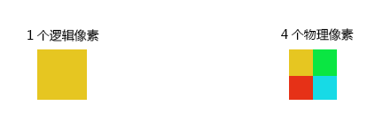

# 关于移动端开发1px线的一些理解及解决办法

## 1px线变粗的原因
在做移动端项目时，常常是根据设计图设置元素节点的大小和样式，但是有时候根据设计图写出来的样式还是不如人意，虽然表面上看起来和设计稿是一样的，可是就是没设计稿那种感觉，而且莫名还有一种山寨的气息，UI审查的时候也常常会觉得分割线或则边框线太粗了，要更细一点，但是一看代码，已经是1px了，为什么看着还是那么粗呢？

要知道问题的原因首先要了解一下几个概念：

#### (1)物理像素(physical pixel)
一个物理像素是显示器（手机屏幕）上最小的物理显示单元（像素颗粒），在操作系统的调度下，每一个设备像素都有自己的颜色值和亮度值。
如：iPhone6上就有750*1334个物理像素颗粒。

#### (2)设备独立像素(density-independent pixel)
设备独立像素（也叫密度无关像素），可以认为是计算机坐标系统中得一个点，这个点代表一个可以由程序使用的虚拟像素（比如：css像素），有时我们也说成是逻辑像素。然后由相关系统转换为物理像素。所以说，物理像素和设备独立像素之间存在着一定的对应关系，这就是接下来要说的设备像素比。

#### (3)设备像素比(device pixel ratio )简称dpr
设备像素比（简称dpr）定义了物理像素和设备独立像素的对应关系。它的值可以按如下的公式的得到：

`设备像素比(dpr) = 物理像素 / 逻辑像素(px)` // 在某一方向上，x方向或者y方向，下图dpr=2



知道了设备像素比，我们就大概知道了1px线变粗的原因。简单来说就是手机屏幕分辨率越来越高了，同样大小的一个手机，它的实际物理像素数更多了。因为不同的移动设备有不同的像素密度，所以我们所写的1px在不同的移动设备上等于这个移动设备的1px。现在做移动端开发时一般都要加上一句话：

```
<meta name="viewport" content="width=device-width, initial-scale=1.0, maximum-scale=1.0, user-scalable=no">
```
这句话定义了本页面的viewport的宽度为设备宽度，初始缩放值和最大缩放值都为1，并禁止了用户缩放。

viewport的设置和屏幕物理分辨率是按比例而不是相同的，移动端window对象有个devicePixelRatio属性，它表示设备物理像素和css像素的比例，在retina屏的iphone手机上，这个值为2或3, css里写的1px长度映射到物理像素上就有2px或3px。通过设置viewport，可以改变css中的1px用多少物理像素来渲染，设置了不同的viewport，当然1px的线条看起来粗细不一致。

## 1px线变粗的解决方法

### 伪类 + scale
这种方法的原理就是把原来元素的border去掉，然后用 :before 或者 :after 重做 border ，原先的元素相对定位，新做的 border 绝对，定位使用 transform 的 scale 把线条高度缩小一半，新边框就相当于0.5px了。代码如下：

```
.scale{
  position: relative;
  border:none;
}
.scale:after{
  content: '';
  position: absolute;
  bottom: 0;
  background: #000;
  width: 100%;
  height: 1px;
  -webkit-transform: scaleY(0.5);
  transform: scaleY(0.5);
  -webkit-transform-origin: 0 0;
  transform-origin: 0 0;
}
```

### 使用flexible.js
前面已经说过1px变粗的原因就在于一刀切的设置viewport宽度，如果能把viewport宽度设置为实际的设备物理宽度，css里的1px不就等于实际1px长了么。 flexible.js的原理就是这样，先获取设备缩放比devicePixelRatio，然后根据缩放比来动态设定viewport的值，这样导致的结果就是无论是哪个设备，1px所表示的永远是1个设备像素，即该设备的最小像素。
```
//devicePixelRatio=2时，输出meta如下
<meta name="viewport" content="initial-scale=0.5, maximum-scale=0.5, minimum-scale=0.5, user-scalable=no">
//devicePixelRatio=3时，输出meta如下
<meta name="viewport" content="initial-scale=0.3333333333333333, maximum-scale=0.3333333333333333, minimum-scale=0.3333333333333333, user-scalable=no">
```

### 使用meta viewport控制
原理如上。代码如下：
```
//1px像素线条
<meta name="viewport" content="width=device-width,initial-scale=1.0,user-scalable=0">
//0.5像素线条
<meta name="viewport" content="width=device-width,initial-scale=0.5,user-scalable=0">
```

### 使用box-shadow模拟边框
利用css 对阴影处理的方式实现0.5px的效果。代码如下：
```
.box-shadow-1px {
  box-shadow: inset 0px -1px 1px -1px #c8c7cc;
}
```

### 使用border-image
首先需要自己制作一个0.5像素的线条作为线条背景图片。。代码如下：
```
p{
    border-width: 0 0 1px 0;
    border-image: imageUrl 2 0 round;
}
```

### 利用背景渐变linear-gradient
利用linear-gradient利用背景图片渐变，从有色到透明，默认方向从上到下，从0deg到50%的地方颜色是边框颜色，然后下边一半颜色就是透明了。然后设置背景宽度100%，高度是1px，再去掉repeat，所以有颜色的就是0.5px的边框。代码如下：
```
.bg_border {
    background-image: linear-gradient(0deg,black 50%,transparent 50%);
    background-size: 100% 1px;
    background-repeat: no-repeat;
}
```
