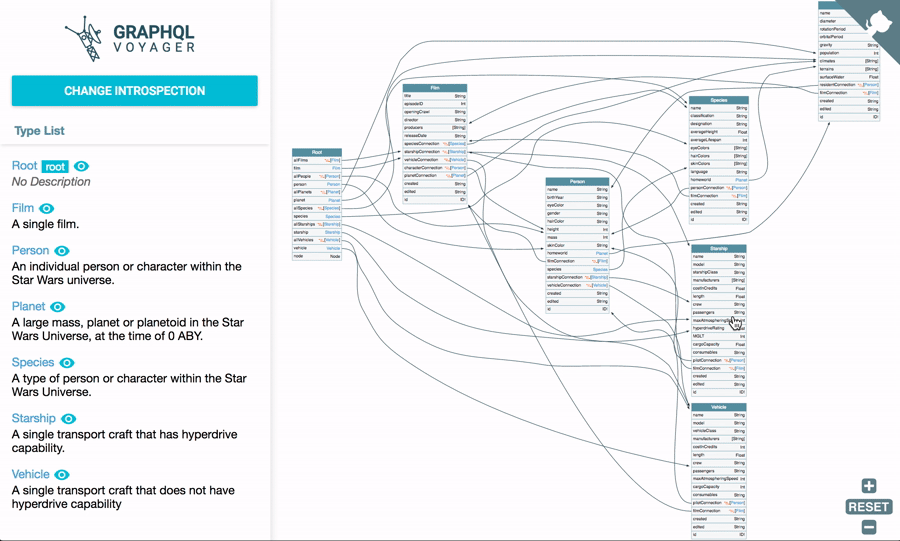

## GraphQL 浅谈，从理解 Graph 开始

### 前言

> GraphQL is a data query language developed internally by Facebook in 2012 before being publicly released in 2015. It provides an alternative to RESTful architectures. —— from wikipedia.

GraphQL 是 Facebook 于 2012 年在内部开发的数据查询语言，在 2015 年开源，旨在提供 RESTful 架构体系的替代方案。

[掘金翻译计划](https://github.com/xitu/gold-miner)在今年 10 月上线了 [GraphQL 中文官网](https://juejin.im/post/59e6f8036fb9a0452404ea37)，最近它的讨论和分享逐渐增多。其实阿里内不少业务线早有尝试和分享，听闻基于 GraphQL 再造了个 TQL。也在其开源的`Node.js`企业级框架`egg`中，发布了对应的 [plugin](https://github.com/eggjs/egg-graphql)。感觉这是一个让广大(前端)开发者(重新)认识学习`GraphQL`的好机会，就让我们来回顾一下它~

### 从 Graph 字面开始

先看官网的解释~

> [GraphQL](http://graphql.cn/) 既是一种用于 API 的查询语言也是一个满足你数据查询的运行时。 

总结的稍显高深，简单拆解一下：

SQL (Structured Query Language) 是**结构化查询语言**的简称。所以`Graph`+ **QL** =`图表化`(可视化)**查询语言**，是一种描述客户端如何向服务端请求数据的`API`语法，类似于 [RESTful](http://www.ruanyifeng.com/blog/2011/09/restful.html) [API](http://www.ruanyifeng.com/blog/2014/05/restful_api.html)。
> 注：不要联想到 MySQL、NoSQL，它不是图形数据库，比如 [Neo4j](https://baike.baidu.com/item/Neo4j/9952114)。
> GraphQL 有配套的数据库服务， [graphcool](https://github.com/graphcool/framework) 可以部署在 Docker 上或运行在基于 BaaS(Backend as a Service) 的 [Graphcool Cloud](http://graph.cool/cloud)。但它不依赖任何数据库，且能和任何后端(SQL、MongoDB、Redis 等)一起使用，也可以包裹在 RESTful API 之上。

### GraphQL 的特性

它定义了一套**类型系统**(`Type System`)，类似于持续演进(相互借鉴)的`Flow`和`TypeScript`，用来描述你的数据，先看官网的例子(细节再议)
```javascript
项目的type
type Project {
  name: String
  tagline: String
  contributors: [User] // 数组表示多个，type 为下面的 User
}
type User {
  name: String
  photo: String,
  friends: [User] // User 的朋友们， type 还是 User
}
```

接下来你可以把`GraphQL`的**查询语言**(`Queries`)当成是没有值只有属性的对象，返回的结果就是有对应值的对象，也就是标准的`JSON`。
```javascript
请求你所要的数据 // 基于 Queries
{ // 查找 name 为 GraphQL 的 project
  project(name: "GraphQL") {
    tagline
  }
}
得到可预测的结果
{ // 返回 json
  "project": {
    "tagline": "A query language for APIs"
  }
}
```

虽然 project 在**类型系统**里定义了三个字段，但我们(客户端)只需要 tagline 这个字段，服务端就只返回这个字段，而 contributors 里的 User 和其对应字段，本次查询(`Query`)并不关心。这个 demo 看似简单，其实又带来了很多特性~

- **强类型**：`GraphQL`与 C 和 Java 等后端语言相得益彰，**服务端**能对响应的形状和性质做出一定保证，而`RESTful`是弱类型的，缺少机器可读的元数据；
- **需求驱动**，`GraphQL`让服务端定义好支持哪些`Queries`，把对数据的`Query`需求下放到客户端管理。服务端负责数据的**能力**客户端负责数据的**需求**，这本身就更符合现代的开发模式，分工更明确同时保持对 API 的聚焦；
- **分层**：`GraphQL`的`Query`本身是一组分层的字段，查询就像返回的数据一样，是一种产品(工程师)描述数据和需求的自然方式；(PS：部分翻译的，国外好像都把产品叫做 Product Engineers.)
- **可预测**：`GraphQL`的查询只返回客户端要求的内容，没有任何冗余(不浪费流量)，而且它**只有一个**接口地址()，由此衍生了另一个特性；
- **向后兼容**：需求变动带来的新增字段不影响老客户端，服务端再也不需要版本号了，极大简化了兼容问题；(App 通常是 1-2 周的固定周期发版，在原生应用不强制升级的世界里，会出现用户 1-2 年都不升级的情况。 这意味可能同时有 52 个版本的客户端查询我们的服务端，在 Fackbook 中 GraphQL API 曾支持了横跨 3 年的移动端)
- **自检性**：`GraphQL`能在执行查询之前(即在开发时)提供描述性错误消息，在给定查询的情况下，工具可以确保**查询语言**的句法是正确有效的，这使得构建**高质量**的客户端变得更加容易；
- **文档同步 & Mock**：基于`GraphQL`开发人员无需再维护散落多处的文档，调用方无需担心过期问题，而且基于**类型系统**的强力支撑和 [graphql-tools](https://github.com/apollographql/graphql-tools)，mocking 会变得无比容易。

`GraphQL`通过它的特性解决了不少问题，当然它不是没缺点的，这个下期再聊~我的观点：当技术栈的缺点因其演进不再明显之时，必是它优点大放光彩之日😊。与此同时`GraphQL`伴随着 graph 带来了很多新的思想~

### GraphQL 的延伸，graphical & graph(s)

图像天然更生动形象易于理解，这意味着`GraphQL`有**交互极强**的工具和生态，比如：
- [graphiql](https://github.com/graphql/graphiql) —— A **graphical interactive** in-browser GraphQL IDE. 一个让我们在浏览器里用**图形交互**的方式探索及书写`GraphQL`的 IDE。
- [graphql-voyager](https://github.com/APIs-guru/graphql-voyager) —— Represent any GraphQL API as an **interactive graph**. It's time to finally see the graph behind GraphQL! 用**交互式图表**展示任意的 GraphQL API，总算能看见`GraphQL`背后的 graph 了!



> 今年 5 月 22 日 GitHub 发文宣布，去年推出的 GitHub GraphQL API 已经正式可用 (production-ready)，并推荐集成商在 GitHub App 中使用最新版本的GraphQL [API V4](https://developer.github.com/v4/explorer/)。我们可以用 [graphql-voyager](https://apis.guru/graphql-voyager/) 探索(但因 Types、Queries、Mutations 较多数据加载略慢)。

后一个工具可把笔者惊艳坏了，想了解它的生态可以在 [awesome-graphql](https://github.com/chentsulin/awesome-graphql) 里寻找。通过它们，所有人都能快速阅读查询文档，调试我们的查询。

PS：感觉主要是方便调用者和团队新人的。不过可以思考一个问题，每天是写代码还是看代码多？看接口文档呢？

#### 另一种思维模式 —— [Thinking in graphs](http://graphql.cn/learn/thinking-in-graphs/)

图是将很多**真实世界**现象变成模型的强大工具，因为它们和我们自然的心理模型和基本过程的口头描述很相似。大家应该都没忘在学校做的数据库设计，笔者简单回顾下当年手绘 [E-R 图](https://baike.baidu.com/item/E-R图/304954)的过程😢

- 一个班级有一个班主任，`1:1`的关系；
- 一个班级有多学生多个教师，`1:n`的关系；
- 每个学生可以上不同的课程，`n:m`的关系。

OK，然后大概就成了下面这个样子，原谅我从百度找的图：


> E-R 图也称实体-联系图(Entity Relationship Diagram)，提供了表示实体类型、属性和联系的方法，用来描述现实世界的概念模型。

- **真实世界**的数据在本质上是**分层**的，今天的大多数产品开发涉及到视图层次结构的创建和操作，这与这些应用程序的结构保持一致。同时我们的开发模式本身也是产品需求驱动的，服务端关注数据的能力(可用性、性能)，客户端关心需求本身(怎么取、取哪些)，这本身就更现代更高效~

- 数据和实体背后的本质也是关系图，我们的服务端用对象和关系的形式处理数据，只不过在数据库用扁平的表格存储它们。以前你可以将负责的业务数据通过导出 E-R 图展现给同事和老板。如今你还可以通过`GraphQL`把到对外暴露的`API`也建模成一张图直接展示给调用方。

- `GraphQL`沉淀出来的数据模型也可以作为一种给你的团队(研发甚至产品)及`API`调用方沟通的共同语言，让大家对这些业务领域的规则形成共同的理解，最终达成**共识**。

`GraphQL`的原理、和`RESTful`的优劣对比以及最佳实践等等，下期再续~

### 参考资料 —— 需要翻墙
来自官方的介绍：
[GraphQL Introduction
](https://reactjs.org/blog/2015/05/01/graphql-introduction.html)

[GraphQL: A data query language](http://graphql.org/blog/graphql-a-query-language/)

来自 InfoQ 的采访：[Facebook开源数据查询语言GraphQL
](http://www.infoq.com/cn/news/2015/10/graphql-your-schema)

来自官方的 Talks：[GraphQL: Designing a Data Language](https://www.youtube.com/watch?v=Oh5oC98ztvI)

30分钟内现场演示用Python、Ruby、Nodejs.js，设计3次 GraphQL Sever：[Zero to GraphQL in 30 Minutes](https://www.youtube.com/watch?v=UBGzsb2UkeY)
