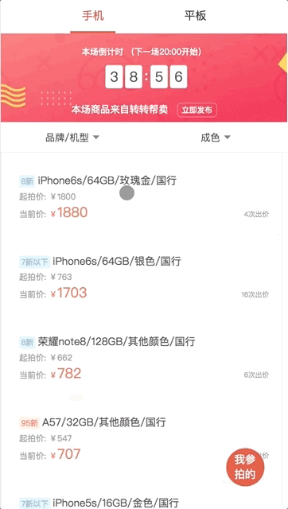
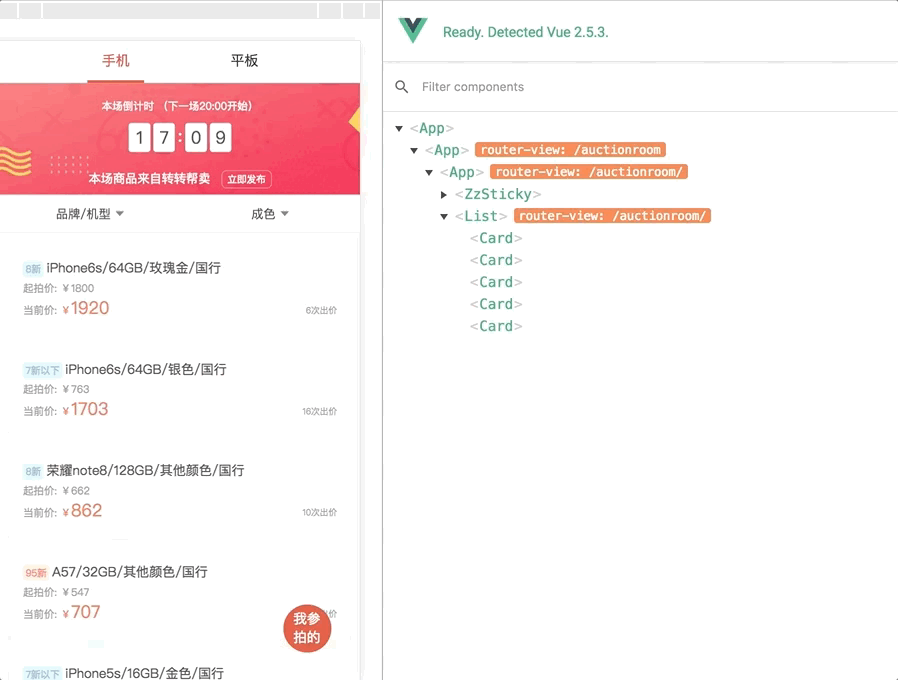
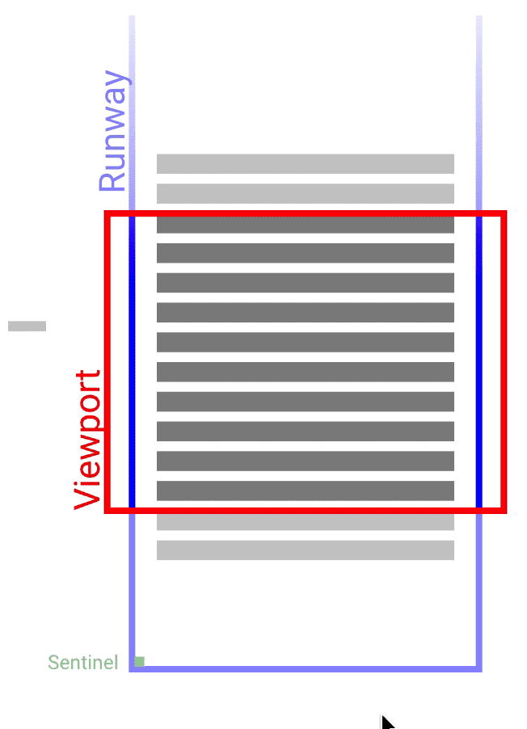
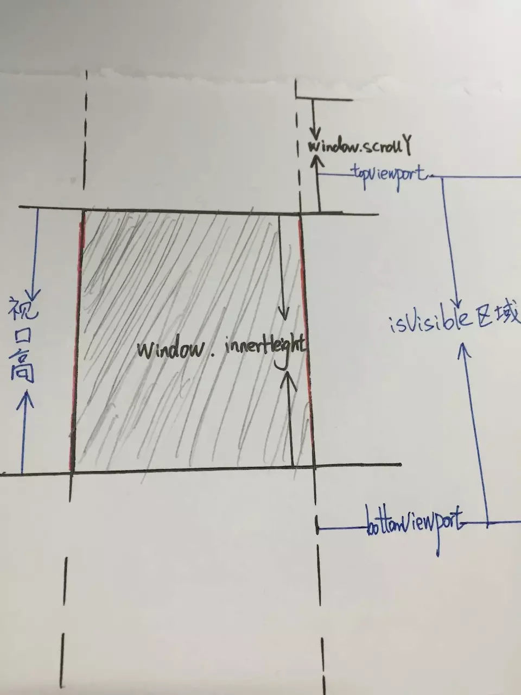

### 从列表到详情，没你想的那么简单

#### 前言
本文先假设我们使用的是 `vue + vuex + vue-router` 的情况来展开讨论，`React` 全家桶的情况应该类似。

在日常的前端研发中，我们经常会遇到如题的场景：比如从商品列表进入商品详情，从订单列表进入订单详情。先看一个 `demo`~



看起来是不是还算丝滑流畅，跟客户端效果较为接近~

#### 正文开始
很多同学应该会说，这不是很容易么，用 `vue-router` + [transition](https://router.vuejs.org/zh-cn/advanced/transitions.html) 就好啦。

```html
<template>
  <transition name="custom-classes-transition"
    :enter-active-class="`animated ${transitionEnter}`"
    :leave-active-class="`animated ${transitionLeave}`">
    <router-view/>
  </transition>
</template>

<script>
export default {
  data: () => ({
    transitionEnter: '',
    transitionLeave: ''
  }),
  watch: {
    '$route' (to, from) {
      const toDepth = to.path.split('/').length
      const fromDepth = from.path.split('/').length
      if (toDepth < fromDepth) {
        this.transitionEnter = 'slideInLeft'
        this.transitionLeave = 'slideOutRight'
      } else {
        this.transitionEnter = 'slideInRight'
        this.transitionLeave = 'slideOutLeft'
      }
    }
  }
}
</script>
```

如上所示，`slide` 的动画使用 [animated.css](https://daneden.github.io/animate.css/)

```scss
<style lang='scss'>
$use-slideInLeft: true;
$use-slideInRight: true;
$use-slideOutLeft: true;
$use-slideOutRight: true;
import "node_modules/animate-sass/animate";
.animated {
  top: 0;
  width: 100%;
  height: 100%;
  animation-duration: calc(300ms);
}
.slideOutRight, .slideOutLeft {
  position: fixed;
}
</style>
```

然后定义好 `router` 的路径规则，笔者采用 [restful](http://www.ruanyifeng.com/blog/2014/05/restful_api.html) 的方式命名。

```javascript
export default new Router({
  routes: [{ // 商品列表
    path: '/',
    name: 'auctionroom',
    component: () => import('app/auction-room/room/app.vue')
  }, {       // 商品详情
    path: ':activityId',
    name: 'auctionroom-item',
    component: () => import('app/auction-room/item/app.vue')
  }]
})
```

真这么容易就能完成需求么？

#### 墓碑元素和路由守卫

实际情况是，我们在进入详情页之前，并没有拿到详情的数据！一般都会选择在 `vue` 组件实例生命周期的 [created](https://cn.vuejs.org/v2/guide/instance.html#实例生命周期) 钩子，获取对应的后端数据接口。

而这个过程跟 `transition` 的动画是并行的，会出现右侧页面还未拿到数据就划入屏幕的情况。如大家所想，我们会尽量让数据源表现的像现实世界遇到的，比如有网络延迟等等。

在这种情况发生时，其实是需要放置一个墓碑条目占位在对应位置，等到数据取到后墓碑条目会被实际内容替代。这样设计的原因是，我们希望墓碑元素在被实际数据替代前可以有一个漂亮的过渡，而不是出现那种生硬的或者让人迷失的效果。


先略这个丑陋的墓碑，实际情况的墓碑元素应该是有设计的，在很多新闻客户端如今日头条中会见到~

比起这一种方案，更常见的方式是在导航完成前获取数据，使用 `router` 的 [beforeRouteEnter](https://router.vuejs.org/zh-cn/advanced/data-fetching.html) 钩子。这个方式固然不错，但同样有潜在的问题：

- 在获取数据时，用户会停留在当前的界面，因此建议在数据获取期间，显示一些进度条或者别的指示。如果数据获取失败，同样有必要展示一些全局的错误提醒。
- 不！能！获取组件实例 `this`，因为当守卫执行前，组件实例还没被创建

#### vuex + keep-alive 和返回刷新


其实在渲染详情的时候，我们在当前列表已经有了一个商品的 `Collection`，一般是个数组。那为什么不能在进入详情时，使用当前已有的数据做填充呢？详情页将这些数据立即渲染，然后再通过接口获取其余部分的数据，等完整数据获取之后再回填到页面上~

采用这个方案，我们必须引入 vuex , 才能在多个页面组件之间传递数据(耗时<10毫秒)，而无需等待网络响应(ajax耗时 > 50毫秒)。同时**依赖后端**接口对于列表和详情的处理须保持一致，即详情接口的字段只可能 ≥ 列表接口的字段。

这也是目前笔者使用的，代码大致如下：
``` javascript
goDetail () {
  const {activityId} = this
  this.$store.commit('AUCTION_DETAIL', this.$props)
  this.$router.push({
    name: 'auctionroom-item',
    params: { activityId }})
}
```

OK，进入的逻辑兼顾了流畅的动画同时并行了数据的异步获取，那么新的问题又来了！我们需要考虑另一种情况：如果用户在列表页下翻了很多次，那么进入详情页再返回，定位得保持不变吧，怎么解决？

##### 分页VS无限滚动

关于分页，最常见的2种模式就是页码分页或使用滚动条，这块在产品设计界也经常被拿出来讨论，找了2篇人人都是产品经理的文章，有兴趣的同学可以延伸阅读。
- [无限滚动：彻底了解它](http://www.woshipm.com/pd/132888.html)
- [无限下拉滚动 VS 分页，究竟该使用哪一个](http://www.woshipm.com/pd/350745.html)

比较简单的结论可归纳为，页码则适用于那些用户在寻找特定信息的搜索结果列表页以及那些用户的浏览记录比较重要的场合，后者适用于向Twitter等那些用户重在消费无限的信息流而并不常搜寻特定的信息的应用，或者说前者多见于 `PC` 端，后者多见于 `H5` 。

如果是页码的模式，那么返回就不再是问题了，因为翻页信息通常会携带在页面`url`中，返回时我们只需要刷新当前页面的信息就可以了。问题这次的项目是后者，产品同学无法接受进入详情的回退让用户重新回顶部~

##### 引入 keep-alive

要解决这个问题，需要使用 `vue` 的一个特性 [keep-alive](https://cn.vuejs.org/v2/api/#keep-alive)，使用原理：
1. 包裹动态组件时会缓存组件实例，而不是销毁
2. `keep-alive` 内路由切换时会调用 `activated` 和 `deactivated` 这两个钩子
3. 套在 `router-view` 外面，受到影响的范围就是 `router-view` 里面的路由跳转。

注意事项：
- 使用后会导致 `created` 可能不被调用，需要把一些逻辑移到 `activated` 
- 针对不需要保留状态的情况，可以在 `deactivated` 中调用 `$destroy()`

返回不刷新的问题解决了，但是产品同学又带来了新的问题，比如用户如果在详情页操作了！比如从订单列表进入详情后，更改了订单状态，那么列表页需要刷新这一条数据。

用 `vuex` 同样可以解决这个问题，在详情页的 `deactivated` 钩子更新列表中对应的该条数据，同样**依赖后端**对于详情和列表接口描述订单采用同样的数据格式，代码大致如下：

``` javascript
deactivated () {
  this.$store.commit('AUCTION_LIST_INDEX', this.index, this.$data)
}
```

最终效果如下：



对于订单这种，只有用户自己操作的数据，用这个方式就能满足需求。但对于商品、竞拍品这类，用户访问时间内有大量数据更新的情况，该方案其实不太完美~

我们或许需要在列表页中缓存当前可视区域的页码，可以使用 [vue-scroller](https://github.com/wangdahoo/vue-scroller)，然后在返回时刷新当前可视区域的数据。然而这就完了吗？你或许还是太天真！

#### 无尽滚动的复杂度

做过 `android、ios、react-native` 开发的同学或许都知道大名鼎鼎的 `ListView、ScrollView、RecyclerView`

或许 Web 端一般没有类似的需求，但其实你也应该知道，DOM节点越多，内存占用越高。我们或许需要在可视区域内，复用列表节点，回收看不见的节点，但为了保持滚动条不因为内容回收导致的塌陷而变化， 还需要对他们做合并。



我就不做过多的拆解，掘金上有一篇来自 Google 大神的译文和一篇对应的引申：
1. [[译] 无尽滚动的复杂度 -- 来自 Google 大神的拆解](https://juejin.im/post/58a3c81e128fe10058c57a8b)
2. [设计无限滚动下拉加载，实践高性能页面真谛](https://juejin.im/post/58b545f0b123db005734634e)



据文中观察，在真正产品线上使用这项技术的还比较少。可能是因为实现复杂度和收益比并不很高。但是，淘宝移动端检索页面实现了类似的思想。如下图，


#### 总结

借用：当你想提供一个高性能的有良好用户体验的功能时，可能技术上一个简单的问题，就会演变成复杂问题的。这篇文章便是一个例证。随着 “Progressive Web Apps” 逐渐成为移动设备的一等公民（会吗？），高性能的良好体验会变得越来越重要。开发者也必须持续的研究使用一些模式来应对性能约束。这些设计的基础当然都是成熟的技术为根本。

我的看法：其实这种优化为什么不是浏览器去做！？

最后做个小广告，**转转**优品手机`帮卖`，让您高价卖掉自个的旧手机~
如果对您有帮助，还请转发到朋友圈~
