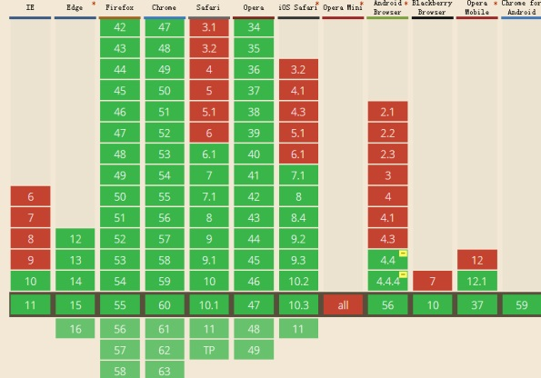
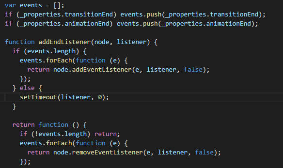
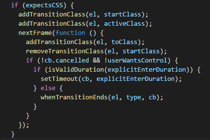

近来看到 饿了么 `App`和 `h5`站上，在商家详情页点餐之后，底部放置了一个点击之后能够弹出模态框查看点餐详情的元素，其中有个背景遮罩层的渐进显隐的效果。


凭着我少许的经验，第一时间的想法是觉得这个遮罩层应该是使用 `display:none;`来控制隐藏和显示的，但是这个属性会破坏 `transition`动画，也就是说如果遮罩层是使用了这个属性来控制显示与隐藏，那么渐进显隐的效果似乎很难达到，效果应该是瞬间显示与隐藏才对。

使用 `Chrome` 模拟移动端，查看了一下 饿了么的实现方式，这才想到 饿了么用到了 `vue`，此动画效果其实是利用了 `vue`自带的过渡动画和钩子函数实现的。


---

## 框架实现

### 基于`vue`的动画渐隐实现

利用框架实现这种效果真的是 `so easy`，不逼逼上代码。

```
// HTML
<div id="app">
	<button class="btn" @click="show = !show">click</button>
	<transition name='fade'>
	  <div class="box1" v-if="show"></div>
	</transition>
</div>

// CSS
.box1 {
  width: 200px;
  height: 200px;
  background-color: green;
}

.fade-enter-active, .fade-leave-active {
  transition: opacity .5s
}
.fade-enter, .fade-leave-to{
  opacity: 0;
}

// JS
.box1 {
  width: 200px;
  height: 200px;
  background-color: green;
}

.fade-enter-active, .fade-leave-active {
  transition: opacity 2s
}
.fade-enter, .fade-leave-to{
  opacity: 0;
}
```

无图无真相，看看效果助助兴：


简直不能更简单

### 基于`react`的动画渐隐实现

`react`本身的单独库没有自带过渡动画，不过有个 [Animation Add-Ons: react-addons-css-transition-group](https://facebook.github.io/react/docs/animation.html)

```
import React, {Component} from 'react'
import ReactDOM from 'react-dom'
import ReactCSSTransitionGroup from 'react-addons-css-transition-group'

class TodoList extends React.Component {
  constructor(props) {
    super(props)
    this.state = {
      show: true
    }
  }

  render() {
    return (
      <div>
        <button onClick={this.changeShow.bind(this)}>click</button>
        <ReactCSSTransitionGroup
          component="div"
          transitionName="fade"
          transitionEnterTimeout={500}
          transitionLeaveTimeout={300}>
          {
            this.state.show &&
            <div className="box1">
            </div>
          }
        </ReactCSSTransitionGroup>
      </div>
    )
  }

  changeShow() {
    this.setState({
      show: !this.state.show
    })
  }
}
```

样式如下：

```
.box1 {
  width: 100px;
  height: 100px;
  background-color: green;
  transition: opacity .5s;
}
.fade-leave.fade-leave-active, .fade-enter {
  opacity: 0;
}

.fade-enter.fade-enter-active, .fade-leave {
  opacity: 1;
}
```

依旧是很 `easy`


---

## 原生实现

以上都是框架实现，但如果项目历史悠久，根本就没用到这些亮瞎人眼的框架，充其量用了个 `1.2`版本的 `jquery`，那么上面方法可都用不到了，我希望找到一种通用的原生方式，不利用任何框架。

### `visibility` 代替  `display`

其中一种方案如题所示，因为 `visibility`这个属性同样能够控制元素的显隐，而且，`visibility`属性在值 `visible` 与 `hidden`的来回切换中，不会破坏元素的 `transition` 动画。

不过 `visibility`与 `display`  之间控制元素显隐的最终效果还是有些差别的。

设置了 `visibility: hidden;` 的元素，视觉上确实是不可见了，但是元素仍然占据该占据的位置，仍然会存在于文档流中，影响页面的布局，只不过设置了此属性的元素在视觉上看不到，在页面的原位置上留下一片空白而已（如果此元素具有宽高并且使用默认定位）。

而设置了 `display:none;`的元素，其既视觉上不可见，同时也不会占据空间，也就是说已经从文档流中消失了。

 `visibility`控制元素显隐同样是瞬时发生的，不过这种瞬时发生的情况又和 `display`的那种瞬时发生不太一样，`display`是根本不会理会设置的 `transition`过渡属性，设置了也和没设置一样。

但 `visibility`是有可能会理会这个值的，不过只理会 过渡时间 `transition-duration`这个属性。

例如，从 `visibility: hidden`到 `visibility: visible;`变化时，如果设置了过渡时间为 `3s`，那么在事件发生后，元素并不会立即呈现出从`hidden`到 `visible`的效果，而是会像下图那样，先等待 `3s`，然后再瞬间隐藏，从显示到最终消失视线中的时间确实 `3s`，只不过并不是逐渐过渡出现的。


上图似乎有个问题，从显示到隐藏确实是等待了 `3s`，但从隐藏到显示，好像还是瞬间完成的，并没有等待 `3s`的说法。

视觉上确实是这样，不过这也只是视觉上的感觉而已，实际上这个等待时间真实存在的，只是看不到而已，另外，这里的 `等待`也不是真的什么都没做纯粹的 `等待`。

之所以 `display`会破坏 `transition`动画，有个说法是，因为 `transition`对元素在整个过渡过程中的状态控制，是根据元素过渡前后起始的状态来计算得出的，例如从 `opacity:0` 到 `opacity:1`的变化，用时 `3s`，那么 `transition`会计算在这 `3s`内的每一帧画面中元素该有的 `opacity`值，从而完成过渡效果，其他的一些属性，例如 `width`、`scale`、`color`等都可以转化为数字进行计算 ([说明文档参见](https://www.w3.org/TR/css3-transitions/#animation-of-property-types-))， 但 `display`是个尴尬的属性，从 `display: none`到 `display:block` 该怎么计算值呢？

计算不了，所以就只能 `破坏了`，`visibility`同样如此，只不过 `visibility`比 `display`稍好一点，因为最起码 `visibility`不会破罐子破摔，不会搞破坏。

从 `visibility: hidden`到 `visibility:visible`的过程中。因为没办法计算过渡阶段没帧的值，所以元素就直接显示出来了，但内在的过渡操作依旧在元素显示出来后显示了 `3s`，而从 `visibility:visible` 到 `visibility: hidden`，元素在视觉上看起来等待的 `3s`内，实际在内部已经在进行 `transition`过渡操作，只不过还是因为没办法计算值，所以到了过渡阶段的最后一刻时，就直接将元素设置为结束状态，也就是隐藏了。

 想要验证这种说法，还需要配合另外一个属性：`opacity`，此属性也是配合 `visibility`完成过渡效果的搭配属性。


实现代码如下
```
// HTML
<button class="btn">click</button>
<div class="box1"></div>
```

```
// CSS
.box1 {
  width: 200px;
  height: 200px;
  background-color: green;
  
  opacity: 0;
  visibility: hidden;
  transition: all 2s linear;
}
.show {
  opacity: .6;
  visibility: visible;
}
```

`js`控制显隐效果代码如下：

```
let box1 = document.querySelector('.box1')
let btn = document.querySelector('button')
btn.addEventListener('click', ()=>{
  let boxClassName = box1.className
  boxClassName.includes('show')
    ? box1.className = boxClassName.slice(0, boxClassName.length-5)
    : box1.className += ' show'
})

```
效果依旧没问题：


因为虽然 `visibility`没办法计算值，但 `opacity`可以，过渡的效果实际上是 `opacity`在起作用。

 其实 `opacity`本身就能控制元素的显隐，把上面代码中的所有 `visibility` 全部删除，效果依旧不变，并且和 `visibility` 一样，设置了 `opacity:0;` 的元素依旧存在于文档流中，`but`，相比于 `visibility: hidden`， `opacity: 0` 的元素并不会出现点透。

而 `visibility: hidden`的元素就会出现点透，点击事件会穿透 `visibility: hidden`的元素，被下面的元素接收到，元素在隐藏的时候，就不会干扰到其他元素的点击事件。

关于这个说法，似乎网上有些争论，但是我用迄今最新版的 `Chrome` `Firefox` 以及 `360浏览器` 进行测试， 都是上面的结果。

如果你只是想让元素简单的渐进显隐，不用管显隐元素会不会遮挡什么点击事件之类的，那么完全可以不用加 `visibility` 属性，加了反而是自找麻烦，但是如果需要考虑到这一点，那么最好加上。

---

### `setTimeOut`

如果不使用 `visibility`的话还好，但是如果使用了此属性，那么上述的解决方案其实还有点小瑕疵，因为 `visibility`从 `IE10`以及 `Android 4.4`才开始支持，如果你需要支持这种版本的浏览器，那么 `visibility` 就派不上用场了。



哎呦呦，公司网站最低要求都是 `IE9`，用不了了诶。

怎么办？再回到 `display` 这个属性上。

为什么 `display` 这个属性会影响到 `transition` 动画的原因上面已经大致说了下，既然问题是出在了 `display` 上，那么我可以同样参考上面 `visibility`的做法，加个 `opocity`属性进行辅助，又因为考虑到 `display` 比起 `visibility` 来说破坏性较大，所以再让`opocity` 与 `display` 分开执行不就行了吗？

你如果写成这种形式：

```
box1.style.display='block'
box1.style.opacity=1
```

其实还是没用的，尽管  `display`值的设定在代码上看起来好像是在 `opacity`前面，但是执行的时候却是几乎同时发生的。

我的理解是应该是浏览器对代码进行了优化，浏览器看到你分两步为同一个元素设置 `CSS`属性，感觉有点浪费，为了更快地完成这两步，它帮你合并了一下，放在一个 `tick`（[参见]((http://www.infoq.com/cn/articles/javascript-high-performance-animation-and-page-rendering) )）内执行，变成一步到位了，也就是同步执行了这两句代码。

那么如何明确地让浏览器不要合并到一个 `tick`内执行呢？`setTimeOut`就派上了用场。

`setTimeOut` 一个重要功能就是延迟执行，只要将 `opacity`属性的设置延迟到 `display`后面执行就行了。

```
// CSS
.box1 {
  width: 200px;
  height: 200px;
  background-color: green;
  
  display: none;
  opacity: 0;
  transition: all 2s linear;
}
```

下面是控制元素渐进显示的代码：
```
// JS
let box1 = document.querySelector('.box1')
let btn = document.querySelector('.btn')
btn.addEventListener('click', ()=>{
  let boxDisplay = box1.style.display
  if(boxDisplay === 'none') {
    box1.style.display='block'
    setTimeout(()=> {
      box1.style.opacity = 0.4
    })
  }
})
```

上述代码中，最关键的就是 `setTimeOut` 这一句，延迟元素 `opacity`属性的设定。

`setTiomeOut`的第二个可选的时间 `delay`参数，我在最新版的 `Chrome`和 `360` 浏览器上测试，此参数可以不写，也可以写成 `0`或者其他数值，但是在 `firefox`上，此参数必须写，不然渐进效果时灵时不灵，而且不能为 `0`，也不能太小，我测出来的最小数值是 `14`，这样才能保证渐进效果，所以为了兼容考虑，最好还是都统一加上时间。

至于为什么是 `14`，我就不清楚了，不过记得以前看过一篇文章，其中说 `CPU`能够反应过来的最低时间就是 `14ms`，我猜可能与这个有关吧。

显示的效果有了，那么要隐藏怎么办？`setTimeOut` 当然也可以，在 `JS`代码的 `if(boxDisplay === 'none')`后面再加个 `else`

```
else {
   box1.style.opacity = 0
   setTimeout(()=>{
     box1.style.display = 'none' 
   }, 2000)
}
```


隐藏时先设置 `opacity`，等 `opacity`过渡完了，再设置 `display:none;`。

但是这里有点不太合理，因为虽然 `setTimeOut`的 `delay`参数 `2000ms`和 `transition` 时间 `2s`一样大，但因为 `JS`是单线程，遵循时间轮询，所以并不能保证 `display`属性的设置刚好是在 `opacity`过渡完了的同时执行，可能会有更多一点的延迟，这取决于过渡动画完成之刻，`JS`主线程是否繁忙。

当然，就算是延迟，一般也不会延迟多长时间的，人眼不太可能感觉得到，如果不那么计较的话其实完全可以无视，但是如果我就吹毛求疵，要想做到更完美，那怎么办？

---

### `transitionend`

`transition` 动画结束的时候，对应着一个事件：`transitionend`，[MDN](https://developer.mozilla.org/en-US/docs/Web/Events/transitionend)上关于此事件的详细如下：
>`transitionend` 事件会在 `CSS transition` 结束后触发. 当 `transition`完成前移除 `transition`时，比如移除 `css`的 `transition-property` 属性，事件将不会被触发，如在 `transition`完成前设置 `display: none`，事件同样不会被触发。

如果你能够使用 `transition`，那么基本上也就能够使用这个事件了，只不过此事件需要加前缀的浏览器比较多（现在最新版的所有 [主流浏览器](http://caniuse.com/#search=transitionend)，都已经不用写前缀了），大致有如下写法：
```
transitionend
webkitTransitionEnd
mozTransitionEnd
oTransitionEnd
```
使用此属性，就可以避免上面 `setTimeOut`可能出现的问题了 ，使用示例如下：

```
// ...
else {
  box1.style.opacity = 0
  box1.addEventListener('transitionend', function(e) {
    box1.style.display = 'none'
  });
 }
```

>需要注意的是，`transitionend` 事件监听的对象是所有 `CSS 中transition`属性指定的值，例如，如果你为元素设置了 `transition: all 3s;`的 样式，那么元素可能无论是`left top`还是 `opacity` 的改变，都会触发该事件，也就是说此事件可能会被触发多次，并且并不一定每次都是你想要触发的，针对这种情况，最好加一个判断。

既然是 涉及到了`JS`实现的动画，那么其实可以考虑一下 把`setTimeout`换成`requestAnimationFrame`。

```
btn.addEventListener('click', ()=>{
  let boxDisplay = box1.style.display
  if(boxDisplay === 'none') {
    box1.style.display='block'
    // setTimeOut 换成 requestAnimationFrame
    requestAnimationFrame(()=> {
      box1.style.opacity = 0.6
    })
  } else {
   box1.style.opacity = 0
   box1.addEventListener('transitionend', function(e) {
     box1.style.display = 'none'
   });
  }
})

```

文章最开始说过的 `vue` 和 `react`这两个框架实现示例动画的方法，也利用到了这个 `API`，，监听动画过渡的状态，为元素添加和删除一系列过渡类名的操作，当然，并不是全部，此事件只能监听动画结束的这个时刻，其他时间点是无法监听的。

- 以下为 `transitionEnd` 在`react-addons-css-transition-group`源码里面出现的形式：



`react-addons-css-transition-group`对 `transitionend`做了兼容，如果浏览器支持此属性，则使用，如果不支持，就使用 `setTimeOut`这种形式。

- 以下为 `transitionEnd` 在`vue`源码里面出现的形式：




另外，顺带一提的是，除了 `transitionend` 事件，还有一个 [animationend](https://developer.mozilla.org/en-US/docs/Web/Events/animationend)事件，此事件是对应 `animation`动画，`react-addons-css-transition-group` 和 `vue`中也都对应着 `transitionend` 出现了此属性的身影，这里就不展开了。


